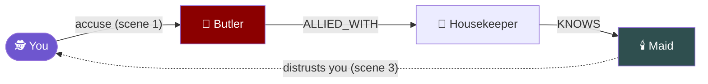
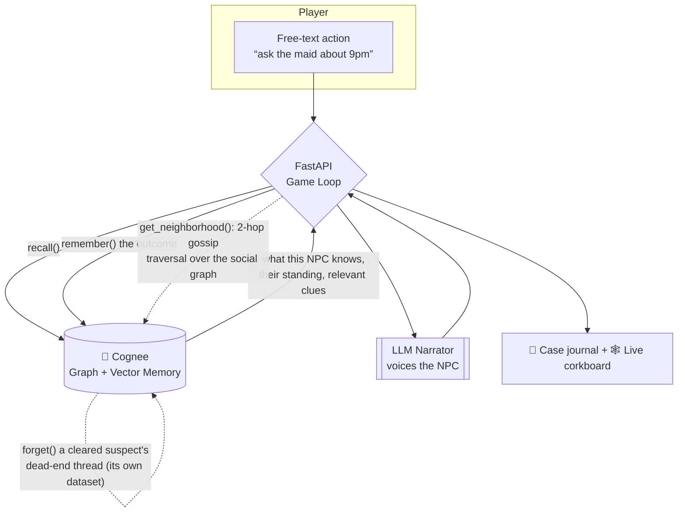

<div align="center">

# 🕯️ The Memory Palace

### A murder mystery where the world *never forgets* — powered by [Cognee](https://github.com/topoteretes/cognee)

[](https://www.python.org/)
[](https://fastapi.tiangolo.com/)
[](https://www.cognee.ai/)
[](https://www.wemakedevs.org/hackathons/cognee)

<em>An AI Game Master that runs a living murder mystery — where a single word to the wrong suspect can turn the whole manor against you three rooms later.</em>

<!-- TODO: drop your hero GIF here. See the "Shot list" section at the bottom for exactly what to record. -->
<!--  -->

</div>

---

## 🎲 First, picture a Game Master

If you've seen *Stranger Things*, you've watched a Game Master at work: one kid sits at the head of the table running the Dungeons & Dragons campaign, describing the torch-lit dungeon, voicing every monster, and remembering that the rogue insulted a merchant two sessions ago. The **Game Master** is the living memory of the whole world. The magic of the game is that *nothing you do is forgotten* — every choice ripples forward.

Now try to build that Game Master out of an AI.

## 🧠 The problem: AI Game Masters have a hangover

Ask an LLM to run a long story and it wakes up with amnesia every few thousand tokens. It forgets who's already dead. It contradicts an alibi it invented an hour ago. It loses track of who told whom what. This isn't a prompt-engineering bug — it's **context collapse**, the wall every long-running AI narrative hits when the world outgrows the context window. (It's exactly what Cognee's [BEAM benchmark](https://github.com/topoteretes/cognee#benchmarks) measures: can a system keep track of a story *as it changes*?)

## 🕯️ The solution: give the manor a memory

**The Memory Palace** is an AI-driven murder mystery where the entire world — every suspect, secret, grudge, alibi, and whispered rumor — lives in a **knowledge graph** managed by [Cognee](https://github.com/topoteretes/cognee), not in the prompt. The Game Master doesn't *remember* the story in its context window; it **queries a graph** that persists and evolves.

The name is a double meaning. A *memory palace* is the ancient technique of storing knowledge by placing it in the rooms of an imagined mansion — which is exactly what we do, except the mansion is a crime scene and the memories are motives.

> **The game is the proof.** If the graph can keep a twelve-suspect murder mystery internally consistent across an hour of free-text play, it can keep your agent consistent across a thousand sessions.

---

## ✨ The moment that matters

Most "AI with memory" demos show the bot recalling your name. That's a lookup — any vector store does it. Here's what a **graph** does that a vector store cannot:

Early in the game, you publicly accuse the **Butler** (Thomas Harrington). You never speak to the maid. But two scenes later, in a completely different wing of the manor, the **Maid** (Cecilia Brand) goes cold and stops answering your questions. Ask *"why won't you talk to me?"* and the Game Master traces the actual chain:



Word traveled **Butler → Housekeeper → Maid** along the social graph. That's a **multi-hop relationship traversal** — "who is within 2 hops of the person I just wronged?" — a question semantic similarity structurally *cannot* answer. It runs through Cognee's graph layer, not an `if` statement — and the `why` command reconstructs the chain from the same traversal path.

---

## 🧩 How it works



The narrator (the LLM) never invents facts — it can only dramatize what it **retrieves from the graph**. Memory and narration are cleanly separated, which is why the story stays consistent.

### 🔑 Where Cognee's memory lifecycle powers the game

| Cognee op | In the story | Why it's load-bearing |
|-----------|--------------|-----------------------|
| **`remember()`** | Seeds the world graph (suspects, relationships, secrets, clues) and records every player action | The entire case lives in the graph, not the prompt |
| **`recall()`** | Fetches what an NPC knows + relevant context before they speak; answers your deductions | Grounds every line the narrator says in retrieved memory, not invention |
| **`improve()` / memify** | Runs between scenes to consolidate the turn's discoveries into the world graph | Turns raw session memories into durable, queryable world state |
| **`forget()`** | On a false accusation, prunes that suspect's dead-end thread — a dedicated dataset — graph nodes and vectors and all | Keeps the working memory lean without touching the real case graph |

### 🕸️ The query a vector store can't do

```python
# When you wrong an NPC, the consequence spreads along real relationships.
# Cognee performs the traversal over its own graph — this is not similarity search.
engine = await get_graph_engine()
nodes, edges = await engine.get_neighborhood([wronged_npc_id], depth=2)

# Keep only the social edges, then BFS outward to find who's within 2 hops.
affected = bfs(seed=wronged_npc_id, edges=edges,
               edge_types={"knows", "family_of", "allied_with", "blackmails"})
for npc, hops in affected.items():
    record_standing_change(npc, toward="player")            # gossip ripples outward
```

The edges come from Cognee's memory; the traversal is a graph algorithm *over Cognee's graph*. Change one relationship in the scenario, re-ingest, and a **different set of NPCs reacts — with zero change to the game loop.**

---

## 🛠️ Tech stack

- **Memory:** self-hosted [Cognee](https://github.com/topoteretes/cognee) — hybrid **graph + vector** store running **100% locally** (Kuzu graph + LanceDB vectors + SQLite), no cloud, no external memory API
- **Backend:** FastAPI + Uvicorn (Python 3.11+)
- **Narration:** LLM via API (configurable provider)
- **Embeddings:** local `fastembed` on CPU — no OpenAI key required
- **Frontend:** a candlelit "detective's desk" — suspect dossiers with live standings, an evidence tray, and a corkboard that draws the gossip red-string, the *why* chain, and the motive→means→opportunity path as you uncover them
- **Scenario:** a single, internally-consistent mystery defined as structured data in `scenario/`

```
the-memory-palace/
├── api/          # FastAPI app + game-loop endpoints
├── game/         # core loop, Cognee memory layer, gossip + accusation logic
├── scenario/     # the murder mystery: suspects, relationships, clues, solution
├── frontend/     # the detective's-desk UI + live corkboard (Cytoscape)
├── scripts/      # ingest_world.py — build the world graph in Cognee
└── main.py       # uvicorn entrypoint
```

---

## 🚀 Quickstart

**Prerequisites:** Python 3.11+ and one LLM API key. That's it — Cognee runs **self-hosted and embedded** (Kuzu + LanceDB + SQLite), so there's no account, no cloud instance, and no external memory service. The graph persists to `./.cognee_system` in the repo.

```bash
# 1. Clone
git clone https://github.com/bishalbera/the-memory-palace.git
cd the-memory-palace

# 2. Install (uv recommended) — pulls cognee[anthropic,fastembed]
uv sync            # or: pip install -e .

# 3. Configure — only the LLM key is required
cp .env.template .env
#   LLM_API_KEY=...            # your Anthropic (or configured provider) key
#   embedding runs locally via fastembed — no extra key needed

# 4. Build the world graph in Cognee (one time; ~2-3 min, ingests the scenario)
python scripts/ingest_world.py

# 5. Play
python main.py     # → http://localhost:8000
```

## 🌐 Play it live

<!-- TODO: paste your deployed URL here once it's up -->
**▶️ Live demo:** _coming soon_ — [play in your browser](#)

---

## 🎥 Demo

<!-- TODO: embed your 60–90s demo GIF/video here -->

**Shot list for the demo GIF (record these beats):**
1. **Setup** — the manor, the body, the twelve suspects appear on the corkboard.
2. **The wrong word** — you publicly accuse the Butler (or Calloway) before the assembled house.
3. **The ripple** — scenes later, an NPC you never met turns cold as their standing flips.
4. **The reveal** — you ask *"why?"* and the Game Master traces the Butler → Housekeeper → Maid chain on the graph.
5. **A contradiction caught** — the game flags two suspects whose alibis don't line up.
6. **The accusation** — you name the killer, and the motive → means → opportunity path lights up.

---

## 🏆 Built for the WeMakeDevs × Cognee Hackathon

**"The Hangover Part AI: Where's My Context?"** — the challenge: *build AI that doesn't wake up with no memory of last night.* The Memory Palace answers it by making persistent, relationship-aware, self-correcting memory the core mechanic of a game you can actually play.

## 🗺️ Roadmap

- [ ] Multiple mysteries / procedurally generated cases
- [ ] Persistent detective across cases (your reputation follows you)
- [ ] Multiplayer parlor — several detectives, one shared graph
- [ ] Voice narration

<div align="center">
<br/>
<em>What happens in the manor stays in the graph.</em>
</div>